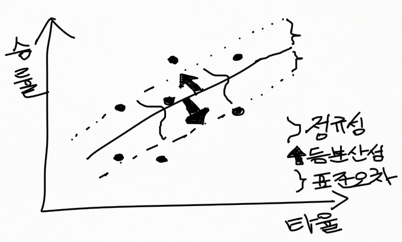

두 변수로 만든 산포도에 뿌려져 있는 점들을 가장 잘 대변하는 선을 찾아내는 것은 좋은 예측모델을 찾는 기준이다. 정규분포 가정에 부합하는 승률의 실제 관측점들이 여러분이 그은 예측선에서 떨어진 정도가 가장 적을 때 회귀선이 결정되며, 모델 추정에 사용된 알고리즘을 최소좌승법(least square model) 이라고 한다.

최소좌승법에서 좌승이란 종속 변수인 실제 승률과 회귀분석이 타율로 예측한 예상 승률간 차이의 제곱이며, 제곱으로 그려지는 정사각형의 면적은 예측점에서 관측점이 벗어나 있는 잔차의 정도를 대변하는데, 잔차가 작을수록 신뢰성이 높은 모델이 된다. 잔차를 제곱한 값들의 합에 산포도상 점들의 수 n에 기울기와 절편을 뺀 자유도를 나눈 평균화된 잔차의 면적에 제곱근을 취하면 관측점마다 다른 크기의 잔차를 표준화하게 되며, 이를 평균제곱근오차 또는 표준오차 (RMSE ; Root Mean Squared Error) 라 한다. 표준오차가 적으면 예측선 주변에 관측점들이 많이 몰려 있어 예측모델이 설명할 수 있는 점들이 많아진다는 의미여서 좋은 모델의 기준이 된다.



하지만 그림에서 보여주듯이 적은 표준오차를 갖는 좋은 모델이 반드시 지켜야 하는 조건들이 있다. 선형회귀분석의 4대 가정이라고 하며, 조건에 부합하지 못하는 모델이 제시하는 예측값에 대해서는 의문을 가질 수밖에 없다. 데이터 분석가가 갖는 훌륭한 예측구슬이 어떤 모습일지 그 속으로 들어가 보자.

### 1. 선형성(linearity)

첫 번째, 선형성(linearity) 에 대한 가정이다. 독립 변수가 팀타율이고 종속 변수가 팀승률일때, 타율이 높을수록 승률이 높아지는 관계는 그래프에서 우상향하는 선을 그을 수 있다. 나이와 홈런간의 관계처럼, 선수생활 전반기에 나이가 들면서 홈런이 증가하다가 전성기를 지나면서 홈런 수가 떨어지는 2차 방정식 비선형모델의 관계를 보여주는 데이터의 경우 선형 회귀분석법이 적합하지 않다. 선형관계가 이론적으로 맞음에도 불구하고 산포도를 눈으로 확인할 때 몇몇 관측치들로 인해 곡선의 관계가 감지되면, 로그함수 또는 지수함수를 이용해 선형으로 만드는 방법이 일반적이다.

```{r}
par(mfrow=c(1,2))
x = c(1,2,4,8,16)
y = c(1,2,3,4,5)
plot(x, y, type='b', lwd=3, main='Before Transformation')
x_adj = log(x)
plot(x_adj, y, type='b', lwd=3, main='After Transformation')
```

### 2. 등분산성(homogeneity)

두 번째, 등분산성(homogeneity) 에 대한 가정이다. 회귀선으로부터 관측된 모든 점이 동등한 분산을 두면서 분포되어 있어야 한다. 동등한 분산인지는 눈으로 확인하기가 쉽지 않으나, 심한 차등은 쉽게 확인된다. 등분산성 확인을 위해서는 5장 '모델에 영향을 주는 이상치를 찾아라' 절에서 자세히 설명하겠지만, 잔차를 보여주는 적합성 그래프 (plot of residual vs. fits)를 활용해 관측값과 예측값의 차이인 잔차가 0을 중심으로 아래위로 불균형하게 퍼져 있는지, 불균형하다면 어떤 점 때문에 불균형이 발생했는지 확인할 수 있다. 해결책으로 분포를 불균형하게 만드는 개별 데이터가 이상치 기준에 해당된다면 제거를 고려할 수도 있고, 등분산의 가정을 요구하지 않는 유연한 분석모델을 채택해서 해결하는 방법도 있다. 다만, 유연한 분석모델을 채택하는 데는 더 많은 데이터가 필요하고, 모으는 데 많은 노력과 시간, 때로는 경제적 비용도 발생한다. 따라서 이분산(heteroscedasticity) 여부를 확인하는 BP(Breush Pagan) 테스트를 먼저 하고, 이분산이 확인됐다면 데이터 분산을 정규성에 가깝게 변형하는 Box Cox 변형으로 개선할 수 있다.

```{r}
library(Lahman)
rec = subset(Teams, yearID == 2014)
rec$wp = rec$W / rec$G
a = lm(wp~R, rec)
library(lmtest)
bptest(a)
```

It implies strong heteroscedasticity
=> Do Box Cox Transformation!
=> We can get a little improvement

```{r }
library(caret)
b = BoxCoxTrans(rec$wp)
c = cbind(rec, wp_adj=predict(b, rec$wp))
d = lm(wp_adj~R, c)
bptest(d)
```


### 3. 독립성(independence)

세 번재, 독립성(independence) 에 대한 가정이다. 개별 데이터들 간에는 아무런 영향이 없어야 한다는 가정이며, 여기에는 두 가지 의미가 담겨 있다. 첫재, 독립 변수는 종속 변수의 오류항과 아무런 연관성이 없어서 결과적으로 종속 변수에서 독립돼야 하며, 두 번째는 종속 변수의 오류가 다른 종속변수의 오류와 상관이 발생하지 않아야 한다.


### 4. 정규성(normality)

네 번째, 정규성에 대한 가정이다. 의존 변수가 정규분포를 따르는지, 한쪽 쏠림현상(skewness) 이 있어 분포의 꼬리가 지나치게 긴지, 중심이 지나치게 높이 솟아 첨도현상(kurtosis) 이 발생하고 있는지에 대한 고민이다. 회귀분석은 중심극한정리에 기반해 반드시 평균에서 가장 빈도가 높고 평균을 중심으로 양옆으로 퍼지면서 빈도가 줄어들어 최솟값과 최댓값에서는 빈도가 가장 낮은 포물선 모양이 정규분포다. 쏠림현상이 발생하는 대표적인 이유는 최솟값 또는 최댓값이 지나치게 낮거나 높은 경우다. 정규성 여부를 확인하기 위해 5장의 '모델에 영향을 주는 이상치를 찾아라' 절에서 다룰 정규확률도(normal probability of the residuals)로 양쪽 꼬리가 중심선에서 벗어나지 않았는지 확인하고, 한쪽으로 치우치거나 벗어나지 않았다면 정규성이 있음을 눈으로 확인할 수 있다.

앞에서 설명한 네 가지 가정에 맞는 데이터를 이용하거나 네 가지 가정에 부합하지 않아서 데이터를 수학적으로 변형하거나 맞는 모델을 찾아서 구한 평균제곱근오차가 제시하는 예측의 정확도는 신뢰할 만하다. 평균제곱근오차 또는 표준오차가 발생하는 이유는 예측값과 현실의 측정값 차이인 잔차 때문이며, 잔차를 표준화한 평균제곱근오차는 표본으로 만든 예측모델을 통해 모집단의 진실값을 예측할 때 표본을 사용하는 이유로 어쩔 수 없이 발생 할 수 밖에 없는 범위다. 이 장 후반부에 소개할 표본오차 (sampling error) 를 구할 때 반드시 필요한 개념이다. R에서 회귀분석으로 나온 결과값 중에서 매우 중요함에도 불구하고 가장 관심을 받지 못하는 평균제곱근오차(Redisual standard error) 를 승률을 예측하기 위한 타율모델과 방어율 모델을 비교해서 설명한다.


- 승률을 예측하는 타율모델과 방어율 모델

```{r}
library(Lahman)
rec = subset(Teams, yearID == 2014)
rec$wp = rec$W/rec$G
rec$avg = rec$H / rec$AB
avg_model = lm(wp~avg, rec)
ERA_model = lm(wp~ERA, rec)
```


### About Residual Standard Error

If we use small residual standard error, we can narrow confidence and prediction interval so that we can improve the decisions.
Otherwise, it's not helpful for decision making.

-타율모델

```{r}
summary(avg_model)
```

- 방어율 모데

```{r}
summary(ERA_model)
```


